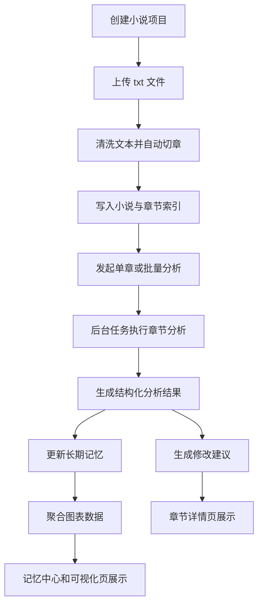

## 1. 产品概述
面向中文网络小说作者的本地化 AI 辅助分析工具，帮助作者从 `txt` 小说稿中快速获得章节分析、修改建议与长期记忆沉淀。
- 解决作者在长篇连载中难以稳定追踪人物、设定、关系、时间线和章节质量的问题
- 产品价值在于降低复盘成本、提升续写稳定性，并为后续可视化和检索增强打基础

## 2. 核心功能

### 2.1 用户角色
| 角色 | 使用方式 | 核心权限 |
|------|----------|----------|
| 本地作者用户 | 本机打开网页使用 | 创建项目、上传 txt、查看分析、管理章节与记忆 |

### 2.2 功能模块
1. **项目首页**：项目列表、新建项目、最近分析任务、系统状态概览
2. **小说详情页**：小说基础信息、章节列表、导入结果、批量分析入口
3. **章节详情页**：章节正文预览、分析结果、修改建议、相关长期记忆摘要
4. **记忆中心页**：人物档案、世界观、势力关系、境界体系、重要事件检索
5. **可视化页**：人物关系图、出场频率、情绪曲线、势力变化、时间线
6. **模型与任务页**：模型配置、任务状态、失败重试、日志概览

### 2.3 页面详情
| 页面名称 | 模块名称 | 功能说明 |
|-----------|-------------|---------------------|
| 项目首页 | 项目列表 | 展示已创建小说项目，支持进入详情和创建新项目 |
| 项目首页 | 快速导入 | 上传 txt 文件并启动导入流程 |
| 项目首页 | 最近任务 | 显示导入、分析、记忆更新任务状态 |
| 小说详情页 | 小说概览 | 显示标题、导入文件、章节总数、分析进度 |
| 小说详情页 | 章节列表 | 展示章节编号、标题、字数、分析状态 |
| 小说详情页 | 批量操作 | 批量分析章节、重试失败任务、刷新进度 |
| 章节详情页 | 正文预览 | 展示章节正文和基础元数据 |
| 章节详情页 | 章节分析 | 展示剧情总结、关键事件、人物出场、情绪变化、世界观新增、伏笔与回收 |
| 章节详情页 | 修改建议 | 展示节奏、逻辑、水文、爽点、情绪铺垫、战力和设定相关建议 |
| 章节详情页 | 相关记忆 | 展示当前章节相关的人物、设定、事件摘要 |
| 记忆中心页 | 人物档案 | 按人物查看身份、状态、出场、关系变化 |
| 记忆中心页 | 世界观条目 | 查看设定、势力、境界体系、重大事件 |
| 可视化页 | 人物关系图 | 展示人物节点和关系边 |
| 可视化页 | 情绪与频率图 | 展示章节情绪曲线与人物出场频率 |
| 可视化页 | 时间线与势力变化 | 展示事件时间线和势力变化记录 |
| 模型与任务页 | 模型配置 | 管理 OpenAI、DeepSeek、Gemini 的密钥与默认模型 |
| 模型与任务页 | 任务面板 | 查看任务状态、错误原因、重试入口 |

## 3. 核心流程
用户先创建小说项目并上传 `txt`，系统自动清洗文本、识别章节标题并完成切章。作者随后按章或批量发起分析，系统在后台生成结构化章节分析和修改建议，并将可累计事实合并进长期记忆。页面再基于结构化结果展示章节分析、人物档案和可视化数据。

## 4. 用户界面设计
### 4.1 设计风格
- 主色：`深墨蓝` 与 `暖金色`，辅以 `灰白纸张色`
- 按钮风格：圆角中等、带轻微立体阴影和悬停高亮
- 字体建议：标题使用有书卷感的中文展示字体，正文使用高可读中文无衬线字体
- 布局风格：桌面优先，顶部导航加双栏信息布局，章节页强调信息分组和阅读感
- 图标风格：简洁线性图标，局部配合书页、卷轴、人物关系节点等视觉隐喻

### 4.2 页面设计概览
| 页面名称 | 模块名称 | UI 元素 |
|-----------|-------------|-------------|
| 项目首页 | 项目列表 | 卡片式项目块、最近任务条、快速导入面板 |
| 小说详情页 | 章节列表 | 左侧章节表格，右侧小说统计和批量操作面板 |
| 章节详情页 | 分析结果 | 多分区卡片布局，重点信息高亮，证据片段用引用样式 |
| 章节详情页 | 修改建议 | 按严重程度和类型分组，支持折叠展开 |
| 记忆中心页 | 档案与设定 | 标签页切换、表格式摘要、详情抽屉 |
| 可视化页 | 图表展示 | 大画布图表区 + 右侧过滤面板 |
| 模型与任务页 | 任务面板 | 状态徽标、错误日志片段、重试按钮 |

### 4.3 响应式
- 默认采用桌面优先设计
- 平板宽度下缩减为单栏或上下分区布局
- 手机端保留基础浏览能力，但一期重点优化桌面使用体验

