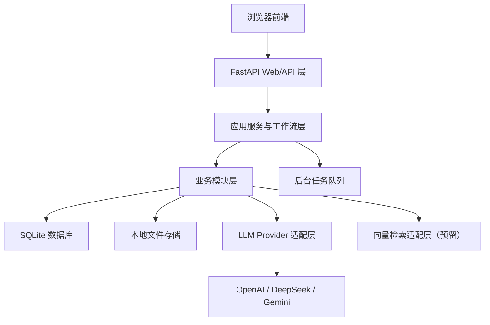
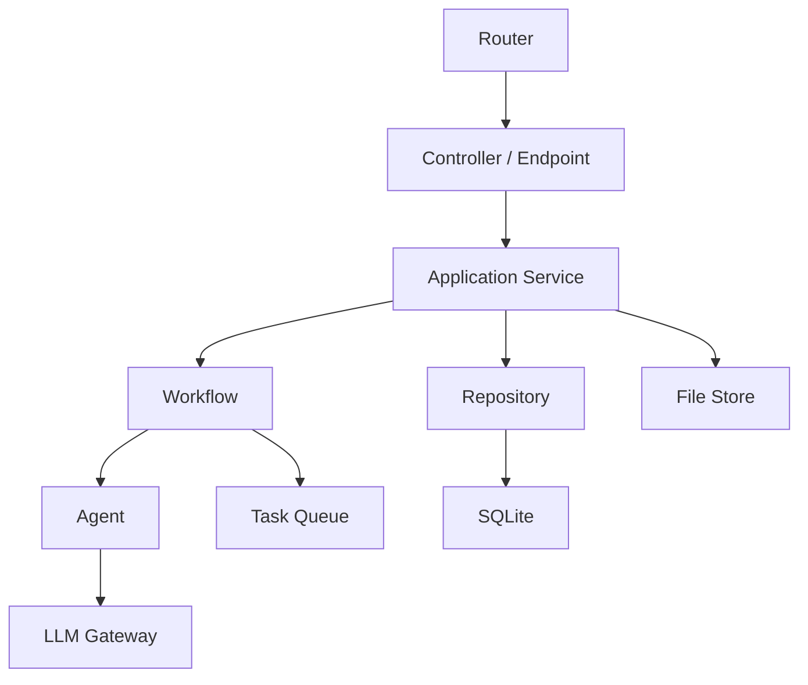
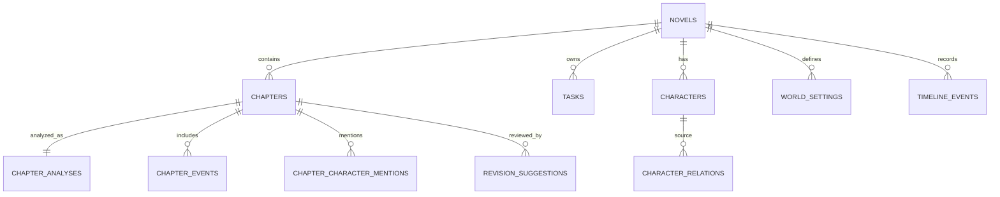

## 1. 架构设计



## 2. 技术说明
- 前端：`FastAPI 模板页面 + 原生 JavaScript + CSS`
- 后端：`FastAPI + Pydantic + Jinja2`
- 数据库：`SQLite`
- ORM：`SQLAlchemy`
- 数据迁移：`Alembic`（首版可后补）
- 任务执行：`in-process queue + worker`
- 文件存储：项目本地目录下 `data/`
- 外部服务：`OpenAI API`、`DeepSeek API`、`Gemini API`

## 3. 路由定义
| 路由 | 用途 |
|-------|---------|
| `/` | 项目首页，查看项目列表与最近任务 |
| `/novels/new` | 新建小说项目页面 |
| `/novels/{novel_id}` | 小说详情页，查看章节列表和分析进度 |
| `/chapters/{chapter_id}` | 章节详情页，查看正文、分析结果和建议 |
| `/memory/{novel_id}` | 记忆中心页，查看人物、设定、事件 |
| `/visualizations/{novel_id}` | 可视化页，查看关系图和趋势图 |
| `/settings/providers` | 模型配置页面 |
| `/tasks` | 任务状态页 |

## 4. API 定义

### 4.1 小说项目
```python
class CreateNovelRequest(BaseModel):
    title: str
    author_name: str | None = None
    description: str | None = None


class NovelResponse(BaseModel):
    id: int
    title: str
    author_name: str | None
    total_chapters: int
    status: str
```

- `POST /api/v1/novels`
  - 创建小说项目
- `GET /api/v1/novels`
  - 获取项目列表
- `GET /api/v1/novels/{novel_id}`
  - 获取小说详情

### 4.2 文件导入
```python
class ImportNovelResponse(BaseModel):
    novel_id: int
    task_id: int
    status: str
```

- `POST /api/v1/novels/{novel_id}/import-txt`
  - 上传 txt 并启动导入流程

### 4.3 章节与分析
```python
class AnalyzeChapterRequest(BaseModel):
    provider_name: str
    model_name: str
    force_reanalyze: bool = False


class AnalyzeChapterResponse(BaseModel):
    chapter_id: int
    task_id: int
    status: str
```

- `GET /api/v1/novels/{novel_id}/chapters`
  - 获取章节列表
- `GET /api/v1/chapters/{chapter_id}`
  - 获取章节详情
- `POST /api/v1/chapters/{chapter_id}/analyze`
  - 发起单章分析任务
- `POST /api/v1/novels/{novel_id}/analyze-batch`
  - 发起批量分析任务

### 4.4 记忆与可视化
- `GET /api/v1/novels/{novel_id}/memory`
  - 获取长期记忆概览
- `GET /api/v1/novels/{novel_id}/visualizations`
  - 获取图表聚合数据

### 4.5 任务与模型
- `GET /api/v1/tasks`
  - 获取任务列表
- `GET /api/v1/tasks/{task_id}`
  - 获取任务详情
- `POST /api/v1/tasks/{task_id}/retry`
  - 重试失败任务
- `GET /api/v1/providers`
  - 获取已配置模型提供方
- `POST /api/v1/providers/test`
  - 测试模型配置可用性

## 5. 服务端架构图



## 6. 数据模型
### 6.1 数据模型定义



### 6.2 数据定义语言
```sql
CREATE TABLE novels (
    id INTEGER PRIMARY KEY AUTOINCREMENT,
    title TEXT NOT NULL,
    author_name TEXT,
    description TEXT,
    source_file_path TEXT,
    total_chapters INTEGER NOT NULL DEFAULT 0,
    status TEXT NOT NULL DEFAULT 'draft',
    created_at DATETIME NOT NULL,
    updated_at DATETIME NOT NULL
);

CREATE TABLE chapters (
    id INTEGER PRIMARY KEY AUTOINCREMENT,
    novel_id INTEGER NOT NULL,
    chapter_no INTEGER NOT NULL,
    volume_no INTEGER,
    title TEXT NOT NULL,
    raw_text_path TEXT,
    clean_text_path TEXT,
    word_count INTEGER NOT NULL DEFAULT 0,
    parse_status TEXT NOT NULL DEFAULT 'pending',
    analysis_status TEXT NOT NULL DEFAULT 'pending',
    created_at DATETIME NOT NULL,
    updated_at DATETIME NOT NULL,
    FOREIGN KEY (novel_id) REFERENCES novels(id)
);

CREATE TABLE tasks (
    id INTEGER PRIMARY KEY AUTOINCREMENT,
    novel_id INTEGER,
    chapter_id INTEGER,
    task_type TEXT NOT NULL,
    status TEXT NOT NULL,
    retry_count INTEGER NOT NULL DEFAULT 0,
    provider_name TEXT,
    model_name TEXT,
    error_message TEXT,
    payload_json TEXT,
    result_json TEXT,
    started_at DATETIME,
    finished_at DATETIME,
    created_at DATETIME NOT NULL,
    updated_at DATETIME NOT NULL,
    FOREIGN KEY (novel_id) REFERENCES novels(id),
    FOREIGN KEY (chapter_id) REFERENCES chapters(id)
);

CREATE TABLE chapter_analyses (
    id INTEGER PRIMARY KEY AUTOINCREMENT,
    novel_id INTEGER NOT NULL,
    chapter_id INTEGER NOT NULL UNIQUE,
    summary TEXT NOT NULL,
    emotion_overview TEXT,
    battle_conflict_summary TEXT,
    world_building_delta_summary TEXT,
    foreshadowing_summary TEXT,
    structured_json TEXT,
    raw_response_path TEXT,
    analysis_version TEXT NOT NULL,
    prompt_version TEXT NOT NULL,
    provider_name TEXT NOT NULL,
    model_name TEXT NOT NULL,
    parse_status TEXT NOT NULL DEFAULT 'success',
    created_at DATETIME NOT NULL,
    updated_at DATETIME NOT NULL,
    FOREIGN KEY (novel_id) REFERENCES novels(id),
    FOREIGN KEY (chapter_id) REFERENCES chapters(id)
);

CREATE INDEX idx_chapters_novel_id ON chapters(novel_id);
CREATE INDEX idx_tasks_status ON tasks(status);
CREATE INDEX idx_tasks_novel_id ON tasks(novel_id);
CREATE INDEX idx_chapter_analyses_novel_id ON chapter_analyses(novel_id);
```

